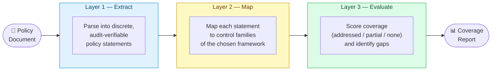

# policy-lens

I built this to scratch a specific itch: I wanted to be able to drop a security policy document into a tool and immediately get a structured answer to "how well does this actually cover [framework X]?" — without sending anything to a cloud API.

`policy-lens` runs entirely on your machine. It takes a policy document, feeds it through a three-layer LLM prompt chain via [Ollama](https://ollama.com), and spits out a coverage report broken down by control family. You can also compare two policies side-by-side, which is handy for vendor assessments.

## Supported Frameworks

| Key | Framework |
|-----|-----------|
| `nist_800_53` | NIST SP 800-53 Rev. 5 *(default)* |
| `iso27001_2022` | ISO/IEC 27001:2022 (Annex A) |
| `soc2_type2` | SOC 2 Type II (Trust Services Criteria) |
| `cis_controls_v8` | CIS Critical Security Controls v8 |
| `adobe_ccf_v5` | Adobe Common Controls Framework (CCF) v5 |

## How It Works

The pipeline is three sequential LLM calls, each feeding structured JSON into the next. Keeping the steps separate makes each prompt much more focused and reliable — trying to do all three in one shot produces garbage.



**Why three layers?**
- **Extract** keeps the LLM focused purely on reading comprehension — pull out the requirements, nothing else.
- **Map** handles the domain knowledge task: which control families does each requirement touch?
- **Evaluate** does the scoring and gap analysis with full context of both the mappings and the framework.

All inference is local. Nothing leaves your machine.

## Web UI

There's a single-file web interface (`index.html`) that calls Ollama directly from the browser — no backend, no build step, no npm.

> **One gotcha:** browsers block requests from `file://` pages due to CORS rules, so you need to serve it over HTTP rather than double-clicking the file. A one-liner does it:

```bash
python3 -m http.server 8080
```

Then open **http://localhost:8080**. The page auto-detects your Ollama models and has a setup guide if something isn't connected.

The web UI supports:
- Analyze mode — single policy, full coverage report
- Compare mode — two policies side-by-side with gap indicators
- Drag-and-drop or paste for text, Markdown, and PDF documents
- Export results as JSON or PDF

## Prerequisites

- **Python 3.10+**
- **[Ollama](https://ollama.com)** installed and running
- A model pulled — any decent instruction-tuned model works:

```bash
ollama pull gemma3        # fast and accurate, recommended
ollama pull llama3.2
ollama pull mistral
```

## Installation

```bash
git clone https://github.com/davidalex89/policy-lens.git
cd policy-lens

python3 -m venv .venv
source .venv/bin/activate
pip install -e .
```

## Quick Start

```bash
# Start Ollama
ollama serve &

# Analyze the sample policy against NIST 800-53
policy-lens examples/sample_policy.txt

# Try a different framework
policy-lens -f cis_controls_v8 examples/sample_policy.txt

# Launch the web UI
python3 -m http.server 8080
```

## CLI Reference

```
policy-lens [-h] [-m MODEL] [-u OLLAMA_URL] [-f FRAMEWORK]
            [-o OUTPUT] [--json] [--pdf FILE] [-t TEMPERATURE] [--timeout TIMEOUT]
            [--compare POLICY_FILE] [--label-a LABEL] [--label-b LABEL]
            [-v]
            policy_file
```

| Flag | Description | Default |
|------|-------------|---------|
| `policy_file` | Path to the policy document (`.txt`, `.md`, `.pdf`) | *(required)* |
| `-m, --model` | Ollama model name | `llama3` |
| `-u, --ollama-url` | Ollama API base URL | `http://localhost:11434` |
| `-f, --framework` | Framework key (see table above) | `nist_800_53` |
| `-o, --output` | Write full JSON results to a file | — |
| `--pdf FILE` | Generate a styled PDF report | — |
| `--json` | Print raw JSON instead of the formatted report | — |
| `-t, --temperature` | LLM sampling temperature | `0.1` |
| `--timeout` | Request timeout in seconds | `300` |
| `--compare POLICY_FILE` | Compare `policy_file` against a second policy | — |
| `--label-a LABEL` | Label for `policy_file` in comparison output | filename |
| `--label-b LABEL` | Label for `--compare` file in comparison output | filename |

### Examples

```bash
# Use a specific model
policy-lens -m gemma3 examples/sample_policy.txt

# Evaluate against ISO 27001:2022
policy-lens -f iso27001_2022 examples/sample_policy.txt

# Generate a PDF report
policy-lens --pdf report.pdf examples/sample_policy.txt

# Save all three layers of output to JSON
policy-lens -o results.json examples/sample_policy.txt

# Script-friendly JSON output
policy-lens --json examples/sample_policy.txt | jq '.evaluation.overall_coverage_pct'
```

## Policy-to-Policy Comparison

This is the feature I find most useful for vendor assessments. Run your internal policy alongside a vendor's policy and see exactly where they fall short.

```bash
# Basic comparison
policy-lens our_policy.txt --compare vendor_policy.txt

# With labels and a specific framework
policy-lens our_policy.txt --compare vendor_policy.txt \
  --label-a "Acme Corp" --label-b "Vendor Co" \
  -f nist_800_53

# Save as PDF
policy-lens our_policy.txt --compare vendor_policy.txt \
  --label-a "Acme Corp" --label-b "Vendor Co" \
  --pdf comparison.pdf
```

Each policy is run through the full pipeline independently, then the per-family scores are diffed:

| Symbol | Meaning |
|--------|---------|
| `▼▼` | Major gap — Policy A: addressed, Policy B: none |
| `▼` | Policy A is one level stronger |
| `=` | Parity |
| `▲` | Policy B is one level stronger |
| `▲▲` | Policy B clearly stronger |

## Adding Your Own Frameworks

Drop a JSON file into `policy_lens/frameworks/` and reference it with `-f your_key`. The schema:

```json
{
  "framework": "Display Name",
  "description": "...",
  "control_families": [
    {
      "id": "XX",
      "name": "Family Name",
      "description": "What this family covers.",
      "example_controls": ["XX-1 Control Name", "XX-2 Another Control"]
    }
  ]
}
```

The prompts are framework-agnostic — the framework name and control families are injected at runtime, so no prompt changes are needed.

## Development

```bash
pip install -e ".[dev]"
pytest tests/ -v
```

## Project Structure

```
policy-lens/
├── policy_lens/
│   ├── analyzer.py          # Pipeline orchestration
│   ├── cli.py               # CLI (analyze + compare modes)
│   ├── comparison.py        # Policy-to-policy diff logic
│   ├── ollama_client.py     # Async Ollama HTTP client
│   ├── report.py            # Rich terminal output
│   ├── pdf_report.py        # PDF generation
│   ├── prompts/
│   │   ├── layer1_extract.py
│   │   ├── layer2_map.py
│   │   └── layer3_evaluate.py
│   └── frameworks/
│       ├── nist_800_53.json
│       ├── iso27001_2022.json
│       ├── soc2_type2.json
│       ├── cis_controls_v8.json
│       └── adobe_ccf_v5.json
├── examples/
│   └── sample_policy.txt
├── tests/
├── index.html               # Web UI
├── pyproject.toml
└── README.md
```

## License

Apache 2.0 — see [LICENSE](LICENSE).
